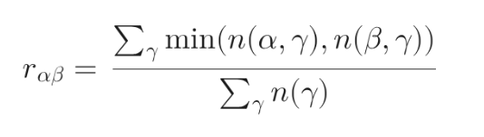
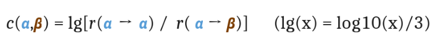
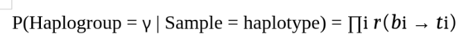
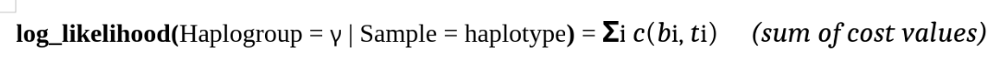

# <span style = 'color:yellow'> Haplogrouping mtDNA by Maximum Likelihood approach (EMMA) #

## <span style = 'color:#66c2a5'> Reference materials: ##
[1. Algorithm - Fluctuation Rate - Cost Value (EMMA)](https://pmc.ncbi.nlm.nih.gov/articles/PMC3819997/)

[2. Variant/Allele count by haplogroup (download the "Allele Counts by Haplogroup in our Current Full-Length GB Set")](https://www.mitomap.org/foswiki/bin/view/MITOMAP/Mitobank)

[3. Haplogroup motifs (Download the "Click here for additional data file." and check sheet "Table S2")](https://pmc.ncbi.nlm.nih.gov/articles/PMC8198973/)


## <span style = 'color:#66c2a5'> Repo structure: ##
mtdna-variant-harmonisation/  
├── 📁 .git/                                        
├── 📄 .gitignore                                  
├── 📄 README.md                                  
│  
├── 🐍 MAIN PIPELINE SCRIPTS:  
│   ├── 00_reconstruct_mtDNA_sequence.py         
│   ├── 01_calculate_fluctuation_rate.py        
│   ├── 02_calculate_cost_value.py           
│   ├── 03_standardize_sample_profile.py               
│   └── 04_classify_haplogroup.py                
│  
├── 🔧 UTILITY SCRIPTS:  
│   ├── check_with_EMPOP_Haplogrep.py           
│   └── demo_df_variant_count.py               
│  
├── 📁 input_dir/                              
│   ├── 📄 demo_input.json                     
│   └── 📁 standardized/                       
│       ├── 242123.json                        
│       ├── 242124.json                       
│       ├── 242125.json                        
│       ├── ...                                
│       └── 245457.json                         
│  
├── 📁 ref_dir/                                 
│   ├── 🧬 rcrs.fasta                            
│   ├── 📊 raw_variant_count.csv               
│   ├── 📊 standardized_variant_count.csv        
│   ├── 🗂️ raw_haplogroup_motif.json           
│   ├── 🗂️ standardized_haplogroup_motif.json    
│   ├── 🗂️ fluctuation_rate.json                 
│   ├── 🗂️ cost_value.json                      
│   ├── 🐍 standardize_variant_count.py         
│   └── 🐍 standardize_haplogroup_motif.py      
│  
└── 📁 classify_dir/                             
    ├── 242123.json                              
    ├── 242124.json                            
    ├── 242125.json                            
    ├── ...                                      
    └── 245457.json                              


## <span style = 'color:#66c2a5'> 1. Terminologies explain: ##
### <span style = 'color:#c2a5cf'> 1.1. What is mtDNA? ###
**mtDNA (mitochondrial DNA)** is the genetic material found inside the mitochondria, which are the energy-producing organelles within cells.  
  
Unlike most of a cell’s DNA, which is located in the nucleus, mtDNA is a small, circular DNA molecule located in the cytoplasm inside the mitochondria.  
  
mtDNA contains 37 genes:  
+ 13 for proteins essential to the mitochondrial electron transport chain (energy production)  
+ 22 for transfer RNA (tRNA)  
+ 2 for ribosomal RNA (rRNA)  
  
mtDNA is inherited exclusively from the mother, making it a powerful tool in genetics, anthropology, and forensic science


### <span style = 'color:#c2a5cf'> 1.2. What is rCRS? ###
**rCRS** stands for the **revised Cambridge Reference Sequence**, which is the standard reference sequence for human mitochondrial DNA (mtDNA) analysis. 

The original Cambridge Reference Sequence (CRS) was first published in 1981 after scientists at Cambridge University sequenced the complete mtDNA of a European woman.  

In 1999, the sequence was revised to correct errors found in the original version, resulting in the rCRS.

The accession number of rCRS: [NC_012920.1](https://www.ncbi.nlm.nih.gov/nuccore/251831106)


### <span style = 'color:#c2a5cf'> 1.3. What is String-based Alignment Method (SAM) for mtDNA? ###
[String-based Alignment Method (SAM)](https://pmc.ncbi.nlm.nih.gov/articles/PMC3064999/) refers to a method of comparing mitochondrial DNA sequences by converting them into continuous nucleotide strings, rather than relying on traditional position-based difference coding relative to a reference sequence like the rCRS.

**The output of SAM is a mtDNA haplotype.**

### <span style = 'color:#c2a5cf'> 1.4. What is Haplotype? ###
A **haplotype** is a set of genetic variations—such as alleles, DNA markers, or polymorphisms—that are **located close together on a single chromosome** and tend to be inherited together from one parent.

Because these variations are physically linked, **they are usually passed down as a unit** rather than being separated during genetic recombination.

**Example:**  
>| Genotype  | Haplotype |  
>| :------:  | :-------: |  
>| AbD / aBd | AbD       |  


### <span style = 'color:#c2a5cf'> 1.5. What is mtDNA Haplotype? ###
**mtDNA haplotype** refers to a specific combination of genetic variants (polymorphisms) found within the mitochondrial DNA (mtDNA) of an individual.  

(mtDNA haplotypes are often resulted from the comparison with rCRS sequence using SAM algorithm) 

Because mtDNA is inherited exclusively from the mother, a person’s mtDNA haplotype reflects their maternal lineage and can be used to trace ancestry and population history.  

**Example of mtDNA Haplotype**:  
>+ Sample 1 haplotype: 16136C 16185T 16223T 16260T 16298C 152C 263G 489C 541Y 315.1C 16189del 249del
>
>+ 73G 152C 263G 489C 16223T 16298C 16327T 315.1C 249del 514del 515del
  
  
**Interpret the mtDNA haplotype**  
>| Example | Illustration | Meaning |
>| :-----: | -----------: | :------ |
>| 73G     | rCRS: A <br> Sample: G | SNP mutation at position 73 from A in rCRS to G in the sample sequence |
>| 498del  | rCRS: C <br> Sample: - | Deletion at position 498 in the sample sequence |
>| 48.1G   | rCRS: C- <br> Sample: CG | The first (or the only one) insertion at position 48 in the sample sequence |
>| 48.2C   | rCRS: C-- <br> Sample: CGC | The second insertion at position 48 in the sample sequence |


### <span style = 'color:#c2a5cf'> 1.6. What is Haplogroup? ###
A **haplogroup** is a genetic population group of people who share a common ancestor on either their paternal (father’s line, traced by Y-chromosome DNA) or maternal (mother’s line, traced by mitochondrial DNA or mtDNA) lineage.  

**Haplogroups are identified by unique sets of inherited genetic markers or mutations (motifs)** that have been passed down through many generations from a single ancestor

**mtDNA Haplogroup motifs example:**  
>+ **Haplogroup L0**: 16129A	16182M	16183M	16187T	16189C	16223T	16230G	16278T	16311C	16519Y	73G	146C	152C	195C	247A	315.1c	750G	769A	825A	1018A	1048T	1438G	2706G	2758A	2885C	3516A	3594T	4104G	4312T	4769G	5442C	6185C	7028T	7146G	7256T	7521A	8468T	8655T	8701G	8860G	9042T	9347G	9540C	10398G	10589A	10664T	10688A	10810C	10873C	10915C	11719A	11914A	12007A	12705T	12720G	13105G	13276G	13506T	13650T	14766T	15326G
>
>+ **Haplogroup L0a1+16293**: 16129A	16148T	16168T	16172C	16182M	16183M	16187T	16188G	16189C	16223T	16230G	16293G	16311C	16320T	16519Y	93G	95M	152C	185A	189G	236C	247A	263G	315.1c	750G	769A	825A	1018A	1048T	1438G	2245G	2706G	2758A	2885C	3516A	3594T	4104G	4312T	4586C	4769G	5096C	5231A	5442C	5460A	5603T	6185C	7028T	7146G	7256T	7521A	8428T	8468T	8566G	8655T	8701G	8860G	9042T	9347G	9540C	9755A	9818T	10398G	10589A	10664T	10688A	10810C	10873C	10915C	11176A	11641G	11719A	11914A	12007A	12705T	12720G	13105G	13276G	13506T	13650T	14308C	14766T	15136T	15326G	15431A


### <span style = 'color:#c2a5cf'> 1.7. Why Haplogroup Classification? ###
- **Maternal Ancestry:** Traces direct maternal lineage using mitochondrial DNA.
- **Population Genetics:** Reveals human migration patterns and population history.
- **Geographic Markers:** Links haplogroups to specific regions or populations.
- **Forensics & Medicine:** Aids in identification and studies disease associations.
- **Ancient DNA:** Helps analyze ancient remains and reconstruct past populations.

*mtDNA haplogroup classification is a key tool in genetics, anthropology, forensics, and medical research.*  


## <span style = 'color:#66c2a5'> 2. Estimating Mitochondrial DNA Haplogroups using a Maximum Likelihood Approach (EMMA): ##
### <span style = 'color:#c2a5cf'> 2.1. Maximum Likelihood and Log-Likelihood ###

**Maximum Likelihood Estimation (MLE)** is a statistical method for estimating parameters that make the observed data most probable.

**Key Concepts:**

- **Basic Principle:** Find parameter values that maximize the probability of observing your data
- **Likelihood Function:** A function that calculates the probability of observing given data for specific parameter values
- **Optimization:** Use calculus (differentiation) to find parameter values where the likelihood function peaks

Given observed data and a parametric model, MLE finds parameters θ that maximize:  


In practice, we often maximize the **log-likelihood** to simplify calculations.  


The likelihood function is a multiplication of probability (or density), while the log-likelihood is a sum. Therefore, log-likelihood is easier to optimize than likelihood.

**NOTE: MAXIMUM LIKELIHOOD IS BASED ON THE ASSUMPTION OF INDEPENDENCE BETWEEN OBSERVATIONS**

**[Maximum Likelihood Examples Link](https://online.stat.psu.edu/stat415/lesson/1/1.2)**

### <span style = 'color:#c2a5cf'> 2.2. Fluctuation Rate ###

Fluctuation rates represent a key concept in the EMMA  algorithm, providing a quantitative measure of mutational stability across different positions in mtDNA.

Fluctuation rates quantify the likelihood of mutations occurring at specific positions within the mitochondrial genome. These rates are calculated based on empirical data from thousands of mtDNA sequences and serve as weights in the maximum likelihood algorithm that assigns haplogroups to mtDNA sequences.

The fundamental idea behind fluctuation rates is that different mutations in the mtDNA sequence have different levels of evolutionary stability. Some mutations rarely occur (low fluctuation rate), while others happen more frequently (high fluctuation rate).

**Formula of Fluctuation Rate**  
  
>+ α and β are elements of the set {A, C, G, T, –} (nucleotides and deletion/insertion)
>+ γ runs over all Control Region Haplogroup Clusters (CR-HGs) where α or β are dominant
>+ n(x,γ) denotes the number of samples in CR-HG γ with symbol x at the position being evaluated
>+ n(γ) denotes the total number of samples in CR-HG γ
> ----------------------------------------------------------------------- 
>If the calculated rate is **zero**, a minimum value is assigned:  
>+ 10^(-6) for transitions (e.g., A↔G, C↔T)  
>+ 10^(-9) for transversions (e.g., A↔C, G↔C) or indels (insertions/deletions)  

**Example of mutation count data**
>|position|reference|mutation|haplogroup|count|total|percentage|  
>|:------:|:-------:|:------:|:--------:|:---:|:---:|:--------:|   
>|5       |A        |C       |B2        |1    |464  |0.22      |  
>|5       |A        |C       |C1d       |1    |219  |0.46      |  
>|5       |A        |C       |H65       |2    |7    |28.57     |  
>|5       |A        |C       |P         |11   |49   |22.45     |  
>|5       |A        |G       |C1b       |1    |509  |0.2       |

***Check file "ref_dir/standardized_variant_count.csv" for all variant count information of along all reported positions and haplogroups.***  
    
**Example of calculating fluctuation rate (using above data table)**
```
At position 5, the reference base is A.  

If any mutation occurs, it can be either A->C, A->G, A->T or A->gap (deletion)  

In other words, the mutation at position 5 can be fluctuated and varied between C, G, T or "gap"  

---------------------------------  
Let's start with α = C  
Then β can be A, G, T or gap

Case 1: α = C and β = G  
> 1.1. γ = Haplogroup B2:
>> n(γ) = n(B2) = 464  
>> n(α,γ) = n(C, B2) = 1  
>> n(β,γ) = n(G, B2) = 0  
>> => min[n(α,γ), n(β,γ)] = 0  

> 1.2. γ = Haplogroup C1d:  
>> n(C1d) = 219  
>> n(C, C1d) = 1  
>> n(G, C1d) = 0  
>> => min[n(α,γ), n(β,γ)] = 0

> 1.3. γ = Haplogroup H65:  
>> n(H65) = 7  
>> n(C, H65) = 2  
>> n(G, H65) = 0  
>> => min[n(α,γ), n(β,γ)] = 0

> 1.4. γ = Haplogroup P: 
>> n(P) = 49  
>> n(C, P) = 11  
>> n(G, P) = 0  
>> => min[n(α,γ), n(β,γ)] = 0

> 1.5. γ = Haplogroup C1b:  
>> n(C1b) = 509  
>> n(C, P) = 0  
>> n(G, P) = 1  
>> => min[n(α,γ), n(β,γ)] = 0

> r_α_β = r_C_G = (0 + 0 + 0 + 0 + 0) / (464 + 219 + 7 + 49 + 509) = 0  
>> Since r_C_G = 0, we have to assign minimum value for this case.  
>> C->G is a tranversion => **r_C_G = 10^(-9)**  

> As we can see that r_C_G = 10^(-9) is quite low, 
> meaning the fluctuation event from C to G rarely happens.

--------------------------------------------------------------------
Do the same for other cases, we will have a collection of fluctuation rates like this:
> r_C_G = 10^(-9)   (case 1)  
> r_C_T = 10^(-6)   (transition)
> r_C_gap = 10^(-9) (deletion)  
> r_C_A = 0.012**   (back mutation into reference base)

=> r_C_C = 1 - [10^(-9) + 10^(-9) + 10^(-9) + 0.012] = 0.988 (stability)
```
***Check file "ref_dir/fluctuation_rate.json" for all fluctuation rates of all cases along all reported positions***

### <span style = 'color:#c2a5cf'> 2.3. Cost Value ###

Since the fluctuation rates are quite small, we will need to convert them into cost values using log function to facilitate following computing steps.

Why it is called Cost Value? We will work it out in the next section (2.4. Haplogroup Classification).

**Formula of Cost Value**  


**Example of calculating fluctuation rate (using previous fluctuation rate results)**  
```
# cost_C_G = log10(r_C_C / r_C_G) * 1/3 = log10[0.988 / 10^(-9)] * 1/3 = 2.998  

# cost_C_T = log10(r_C_C / r_C_T) * 1/3 = log10[0.988 / 10^(-6)] * 1/3 = 1.998  

# cost_C_gap = log10(r_C_C / r_C_gap) * 1/3 = log10[0.988 / 10^(-9)] * 1/3 = 2.998  
  
# cost_C_A = log10(r_C_C / r_C_A) * 1/3 = log10[0.988 / 0.012] * 1/3 = 0.638  
```  
  
**As we can see, the lower the fluctuation rate, the higher the cost value is.**

***Check file "ref_dir/cost_value.json" for all cost values of all cases along all reported positions***


### <span style = 'color:#c2a5cf'> 2.4. Haplogroup Classification ###
As being described from the beginning, EMMA is based on Maximum Likelihood approach.  

**EMMA adapts the fluctuation rates to the Maximum Likelihood formula as below:**  
  
> + γ is the name of the candidate haplogroup
> + haplotype is the variant profile of a sample
> + r(bi → ti) is the fluctuation rate of the **variant mismatch** between the haplogroup motif and the sample haplotype


**Given an example like below:**
```
> Sample haplotype: 35A 36T 44G 55gap 72.1C (gap = deletion)
>> Haplogroup M: 35A 36G 44C 72.1C
>> Haplogroup N: 35A 36T 44A 55gap
--------------------------------------------------------------    
> Mismatch between haplogroup M and sample: 
>> 36G->T
>> 44C->G
>> 55T->gap (T here is the reference base)  
>> => P(M | Sample) = r36_G_T * r44_C_G * r55_T_gap  
--------------------------------------------------------------    
> Mismatch between haplogroup N and sample: 
>> 44A->G
>> 72.1gap->C ("gap" here means insertion)  
>> => P(N | Sample) = r44_A_G * r72.1_gap_C  
--------------------------------------------------------------      
# If P(M | Sample) > P(N | Sample), then Sample is more **likely** to belong to haplogroup M  

# Otherwise, Sample is more **likely** to belong to haplogroup N
```
**However, as described above, the fluctuation rates are very small. So, for more convenient computation, we will convert the fluctuation rates into cost values. Hence, the goal now is to MINIMIZE the sum of cost values**  
  

Applying to the above example, we have:  
```
# log_likelihood(M | Sample) = cost36_G_T + cost44_C_G + cost55_T_gap  

# log_likelihood(N | Sample) = cost44_A_G + cost72.1_gap_C
-----------------------------------------------------------------------------    
# If log_likelihood(M | Sample) < log_likelihood(N | Sample), i.e the sum of cost values of group M < group N, 
# then the Sample is more LIKELY to belong to haplogroup M  

# Otherwise, Sample is more LIKELY to belong to haplogroup N
```
**Why is it called "cost value"?**
> + The term "cost value" is used as an analogy to penalty or score.  
> + It quantifies how "far" or "different" an observed result is from an expected or ideal result.  
> + So, the "cost value" here represents a penalty for mismatches or unlikely events when comparing two sequences (for example, your mtDNA sample and a reference haplogroup motif).
> + Lower cost = better match (more likely, less penalized).  
> + Higher cost = worse match (less likely, more penalized).  
> + Likelihood ~ Fluctuation_Rate ~ 1 / Cost_Value


## <span style = 'color:#66c2a5'> 3. Pipeline Explanation: ##
### <span style = 'color:#c2a5cf'> 3.1. module standardize_haplogroup_motif.py ###

This module aims to standardize all haplogroup motifs to make it easier for indexing and querying.  

Below are the standardization rules applied in this module.  

> **Rule 1: all insertions and deletions are described by "gap"**  
> For example:
>> 309.2A => "309.2": {"ref": "gap", "alt": "A"}  
>> 27del => "27": {"ref": "C", "alt": "gap"}  

> **Rule 2: nucleotides and heteroplasmies are written in uppercase**  
> For example:
>> 309.1c => "309.1": {"ref": "gap", "alt": "C"}  

```
# Run module from terminal (no need to parse arguments):
python3 ref_dir/standardize_haplogroup_motif.py  
  
# Input: ref_dir/raw_haplogroup_motif.json
# Output: ref_dir/standardized_haplogroup_motif.json
```

***NOTE: Only run this module when you have new updates in raw_haplogroup_motif.json***
  
### <span style = 'color:#c2a5cf'> 3.2. module standardize_variant_count.py ###

This module aims to standardize all variant counts by position and by haplogroup to make it easier for calculating fluctuation rates and cost values.    

Below are the standardization rules applied in this module.  

> **Rule 1: all insertions and deletions are described by "gap"**  

> **Rule 2: each row displays ONE variant only**  
> For example (insertion):  
>> pos,ref,alt  
>> 16533,T,TTT  
>> --- || ---  
>> --- V ---  
>> pos,ref,alt  
>> 16533.1,gap,T  
>> 16533.2,gap,T  
> -----------------------
> For example (deletion):  
>> pos,ref,alt  
>> 46,TG,del  
>> --- || ---  
>> --- V ---  
>> pos,ref,alt  
>> 46,T,gap  
>> 47,G,gap   
  
> **Rule 3: All heteroplasmies must be split into individul cases**  
> For example (deletion):  
>> pos,ref,alt  
>> 3106,CN,del   
>> --- || ---  
>> --- V ---  
>> pos,ref,alt  
>> 3106,C,gap  
>> 3107,A,gap  
>> 3107,T,gap  
>> 3107,G,gap  
>> 3107,C,gap     
>
> (N matches all A, T, G or C)  

```
# Run module from terminal (no need to parse arguments):
python3 ref_dir/standardize_variant_count.py  
  
# Input: ref_dir/raw_variant_count.csv
# Output: ref_dir/standardized_variant_count.csv
```  

***NOTE: Only run this module when you have new updates in raw_variant_count.csv***  

### <span style = 'color:#c2a5cf'> 3.3. module 01_calculate_fluctuation_rate.py   
This module aims to calculate the fluctuation rates based on principles explained above.  

```
# Run module from terminal
python3 01_calculate_fluctuation_rate.py -i ref_dir/standardized_variant_count.csv -o ref_dir/fluctuation_rate.json -c 10  
  
# Input: ref_dir/standardized_variant_count.csv  
# Output: ref_dir/fluctuation_rate.json  

# Display help
python3 01_calculate_fluctuation_rate.py -h

# Example of output:
{
    "5": {
        "T": {
            "A": 1e-09,
            "C": 1e-06,
            "gap": 1e-09,
            "G": 1e-09
        },
        "gap": {
            "T": 1e-09,
            "A": 1e-09,
            "C": 1e-09,
            "G": 1e-09
        },
        "A": {
            "T": 1e-09,
            "C": 0.01201923076923077,
            "gap": 1e-09,
            "G": 0.0008012820512820513
        },
        "C": {
            "T": 1e-06,
            "A": 0.01201923076923077,
            "gap": 1e-09,
            "G": 1e-09
        },
        "G": {
            "T": 1e-09,
            "A": 0.0008012820512820513,
            "C": 1e-09,
            "gap": 1e-09
        }
    }
}
```   
  
***NOTE: Only run this module when you have new updates in standardized_variant_count.csv***  
  
### <span style = 'color:#c2a5cf'> 3.4. module 02_calculate_cost_value.py    
This module aims to calculate the cost values based on principles explained above.  
 

```
# Run module from terminal
python3 02_calculate_cost_value.py -i ref_dir/fluctuation_rate.json -o ref_dir/cost_value.json -c 10   
  
# Input: ref_dir/fluctuation_rate.json    
# Output: ref_dir/cost_value.json 
  
# Display help
python3 02_calculate_cost_value.py -h
  
# Example of output:
{
    "5": {
        "T": {
            "A": 2.9999998548008056,
            "C": 1.9999998548008053,
            "gap": 2.9999998548008056,
            "G": 2.9999998548008056
        },
        "gap": {
            "T": 2.999999999420941,
            "A": 2.999999999420941,
            "C": 2.999999999420941,
            "G": 2.999999999420941
        },
        "A": {
            "T": 2.998132040534044,
            "C": 0.6381731492976187,
            "gap": 2.998132040534044,
            "G": 1.0302035689828457
        },
        "C": {
            "T": 1.998249350264026,
            "A": 0.6382904590276005,
            "gap": 2.9982493502640257,
            "G": 2.9982493502640257
        },
        "G": {
            "T": 2.9998839556094032,
            "A": 1.0319554840582048,
            "C": 2.9998839556094032,
            "gap": 2.9998839556094032
        }
    }
}
```   
  
***NOTE: Only run this module when you have new updates in fluctuation_rate.csv***  


### <span style = 'color:#c2a5cf'> 3.5. module 03_standardize_sample_profile.py  
This module aims to standardize all the input data from the input_dir into a uniform format to facilitate following computing steps.  

```
# Run module from terminal
python3 03_standardize_sample_profile.py -i input_dir/ -o input_dir/standardized -r ref_dir/rcrs.fasta -c 4  

# Input: input_dir/... JSON sample files ...
# Output: input_dir/standardized/ ... JSON sample files ...  

# Display help
python3 03_standardize_sample_profile.py -h

# Example of output:
{
    "ranges": "16045-16299 125-309 438-576",
    "263": {
        "ref": "A",
        "alt": "G"
    },
    "491": {
        "ref": "C",
        "alt": "T"
    },
    "16093": {
        "ref": "T",
        "alt": "C"
    },
    "16181": {
        "ref": "A",
        "alt": "C"
    }
}
```  
  
### <span style = 'color:#c2a5cf'> 3.6. module 04_classify_haplogroup.py  
This module aims to classifies the standardized samples into the most probable haplogroups based on the principles explained above.  


```
# Run module from terminal
python3 04_classify_haplogroup.py -i input_dir/standardized -o classify_dir/ -r ref_dir/ -c 10  
  
# Input: input_dir/standardized/ ...JSON sample files ...
# Output: classify_dir/ ... JSON classified sample files ...    
# Reference: ref_dir/ ... fluctuation_rate.json and cost_value.json ...  
  
# Display help
python3 04_classify_haplogroup.py -h

# Example of output:
{
    "B4g": 4.89564519734643,
    "B4g1": 4.89564519734643,
    "B4g1a": 4.89564519734643,
    "B4g1b": 4.89564519734643,
    "B4g2": 4.89564519734643,
    "B4g2*": 4.89564519734643,
    "B4a1a1a2": 5.479040997895875,
    "B4a1a1a2a": 5.479040997895875,
    "B4a1a1a2b": 5.479040997895875,
    "B4a1a1a2*": 5.479040997895875
}
```  
  
***The less score the haplogroup has, the more probable that haplogroup is.***  
***The lowest score = The most probable haplogroup***
  
# <span style = 'color:yellow'> --- END OF DOCUMENT --- #
